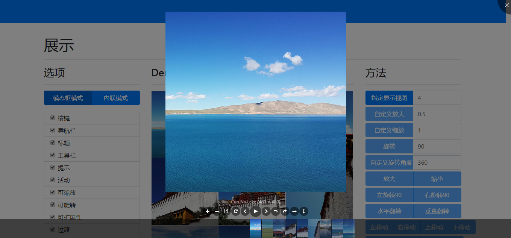
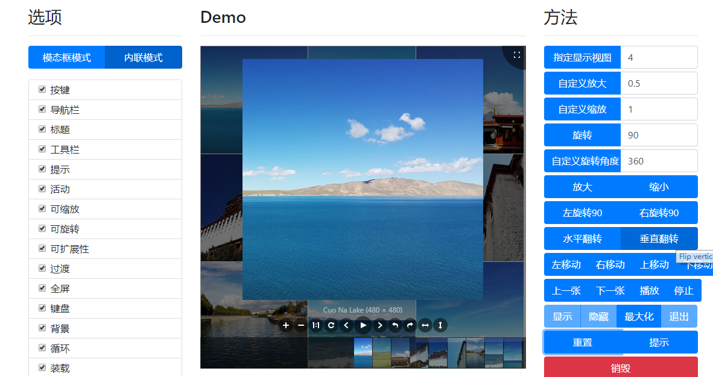

### 创建一个空项目

demo 结构 ,因为界面外观使用了bootstarp 风格 ，所以需要使用 bootstarp 样式

```
demo
	|
	|_public
		|_bootstap
			|_css
				|_bootstrap.min.css
             |_bootstrap.bundle.min.js
         |_jquery
         	|_jquery-1.12.4.min.js
         |_viewer
         	|_css
         		|_viewer.css
         	|_jquery-viewer.js
         	|_viewer.js
         |_require.min.js
     |_src
     	|_comm
     		|_app.js
     		|_header.js
     	|_viewerdemo
     		|_css
     		|_images
     		|_js
     		|_index.html
     		
```

$$
app.js requirejs配置
$$

```js
//require配置
var date = new Date();
var publicBase = "public/";
require.config({
    baseUrl: '../../../../',
    paths: {
        jquery: publicBase + 'jquery/jquery-1.12.4.min',
        bootstrap: publicBase + 'bootstarp/bootstrap.bundle.min',
        viewerjs: publicBase + 'viewer/viewer',
        juqeryViewer: publicBase + 'viewer/jquery-viewer',
    },
    //1. deps 表示依赖 的 js 如 boostrap 需要依赖 jquery
    //2. exports 表示当前模块的返回值
    shim: {
        bootstrap: {
            deps: ['jquery']
        },
        viewerjs: {   // 坑： 因为 jquery-viewer 需要依赖 viewerjs  ，所以 viewer.js 的名称必须 viewerjs，否则报错
            deps: ['jquery'],
            exports: 'viewerjs'
        },
        juqeryViewer: {
            deps: ['jquery', 'viewerjs'],
            exports: 'juqeryViewer'
        }
    }
});
// 初始化加载的模块
define([
        'jquery',
        'bootstrap',
        'viewerjs',
        'juqeryViewer'
    ]
);
console.log('requirejs 加载成功！'+date);
```

$$
header.js 公共样式头加载
$$

```js
(function () {
    var data = {
        meta: [
            "<meta name=\'renderer\' content=\'webkit\'/>",
            "<meta name=\'viewport\' content=\'width=device-width, initial-scale=1, maximum-scale=1, minimum-scale=1, user-scalable=no\'>",
            "<meta name=\'mobile-web-app-capable\' content=\'yes\'>",
            "<meta name=\'apple-mobile-web-app-capable\' content=\'yes\'>",
            "<meta name=\'apple-mobile-web-app-status-bar-style\' content=\'black-translucent\'>"
        ],
        css: [
            "<link rel=\'stylesheet\' href='../../../../public/bootstarp/css/bootstrap.min.css\'/>",
            "<link rel=\'stylesheet\' href='../../../../public/viewer/css/viewer.css\'/>"
        ],
        elements: [
            "<div id=\'_loading\' class='csshub-loading-layer'><div class=\'csshub-loading csshub-loading-box\'><div></div><div></div><div></div><div></div><div></div></div></div>"
        ]
    }

    var htmlStr = data.meta.concat(data.css, data.elements).join("");
    document.writeln(htmlStr);
}());
```

$$
index.html 配置 body 代码省略，具体查看github 源码
$$


```html
<!DOCTYPE html>
<html lang="en">
<head>
    <meta charset="utf-8">
    <meta http-equiv="x-ua-compatible" content="ie=edge">
    <title>jquery-viewer</title>
    <!--引入公共样式-->
    <script src="../comm/header.js"></script>
</head>
<body>
	...省略
	<script data-main="js/index" src="../../public/require.min.js"></script>
</body>
</html>

```

浏览器访问效果





我用的是nginx 加载界面, nginx.conf 配置

````
server {
		  listen          8081;
		  server_name     localhost;
		  index   index.html;
		  root   D:/Project/viewer-requirejs-demo;
		  # HOME PAGE
		  location ~ /$ {
		    root   D:/Project\viewer-requirejs-demo;
		    index   index.html index.htm;
		  }
		  # SUB PAGE
		  location ~ /*\..*$ {
		    root   D:/Project/viewer-requirejs-demo;
		    index   index.html index.htm;
		  }
}
````


github代码地址：https://github.com/yinxiulong/viewer-requirejs-demo.git 

​				